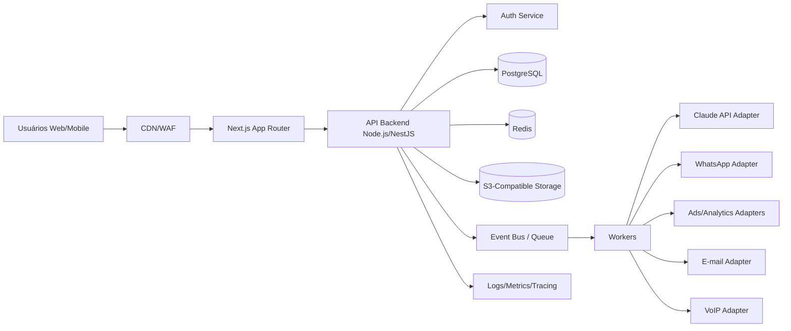
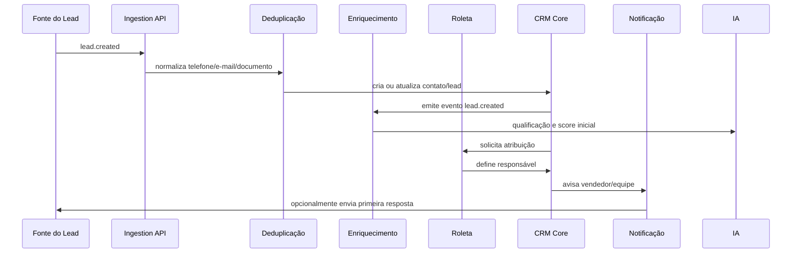

# Blueprint de CRM SaaS Multi-Tenant com IA, Omnichannel e Automação Comercial

## 1. Visão executiva do produto

Este documento define uma arquitetura completa para um CRM SaaS moderno, seguro, escalável e multi-nicho, começando por consórcios e imobiliárias, mas desenhado desde o primeiro dia para atender outros segmentos de vendas consultivas, serviços financeiros, educação, saúde, franquias, seguros, energia solar, B2B e qualquer operação comercial orientada a leads, oportunidades, contratos e relacionamento.

O produto deve ser construído como plataforma SaaS modular, multi-tenant, API-first e event-driven, evitando dependência de plataformas proprietárias fechadas. A proposta é entregar rapidamente um MVP em até 90 dias, mantendo fundações técnicas sólidas para expansão internacional, integrações omnichannel, automações avançadas e inteligência artificial aplicada ao ciclo comercial.

### 1.1 Objetivos principais

- Centralizar leads, clientes, oportunidades, contratos, documentos, tarefas, agenda, mensagens e relatórios.
- Permitir que cada empresa configure funis, etapas, campos, permissões, roletas, metas, modelos de campanha e automações sem customização pesada.
- Capturar leads de WhatsApp, Meta Ads, Google Ads, landing pages, formulários externos, telefonia, webhooks e importações.
- Distribuir leads automaticamente por regras configuráveis, peso, disponibilidade, região, segmento, desempenho e critérios personalizados.
- Usar IA com Claude API para qualificação, intenção de compra, respostas comerciais, resumos, previsão de fechamento, campanhas, insights e recomendações estratégicas.
- Manter conformidade com LGPD, rastreabilidade, consentimento, segurança por camadas e capacidade de auditoria.
- Reduzir custo operacional e dependência externa com código próprio, banco relacional robusto, filas, workers, observabilidade e documentação automática.

### 1.2 Princípios arquiteturais

- **Multi-tenant desde o início:** todas as entidades de negócio devem carregar `tenant_id`, com isolamento lógico por Row Level Security, políticas de acesso e índices compostos.
- **API-first:** o front-end consome APIs internas versionadas, e integrações externas usam endpoints públicos controlados por escopos, webhooks e chaves rotacionáveis.
- **Modularidade por domínio:** CRM Core, Omnichannel, Marketing, IA, Billing, Landing Pages, Relatórios e Administração devem evoluir de forma independente.
- **Event-driven:** eventos de domínio disparam automações, integrações, notificações, enriquecimento por IA, tarefas e dashboards.
- **Segurança por padrão:** autenticação robusta, MFA, criptografia, auditoria, least privilege, segregação de dados e proteção contra abuso.
- **Configuração antes de customização:** segmentos como consórcio e imobiliário devem ser tratados por templates, tipos de objeto, campos customizados e automações configuráveis.
- **Baixo acoplamento a fornecedores:** priorizar PostgreSQL, Next.js, Node.js/TypeScript, filas abertas, storage S3-compatible e providers substituíveis.

## 2. Mapa completo do produto

### 2.1 Módulos funcionais

```mermaid
flowchart TD
    A[Portal SaaS / Tenant] --> B[CRM Core]
    A --> C[Administração e Segurança]
    A --> D[Omnichannel]
    A --> E[Marketing e Landing Pages]
    A --> F[IA Comercial]
    A --> G[Relatórios e BI]
    A --> H[Billing e Planos]

    B --> B1[Leads]
    B --> B2[Clientes]
    B --> B3[Oportunidades]
    B --> B4[Contratos]
    B --> B5[Documentos]
    B --> B6[Tarefas e Agenda]
    B --> B7[Funis Customizáveis]
    B --> B8[Metas e Comissões]

    D --> D1[WhatsApp Business API]
    D --> D2[E-mail]
    D --> D3[Telefonia VoIP]
    D --> D4[Webhooks]
    D --> D5[Inbox Unificada]

    E --> E1[Construtor Drag-and-Drop]
    E --> E2[Formulários Inteligentes]
    E --> E3[Pixels e Eventos]
    E --> E4[Campanhas]

    F --> F1[Qualificação]
    F --> F2[Respostas Sugeridas]
    F --> F3[Resumo de Conversas]
    F --> F4[Previsão de Fechamento]
    F --> F5[Recomendações]
```



### 2.2 Objetos de negócio essenciais

- **Tenant:** empresa contratante do SaaS.
- **Filial:** unidade comercial, regional, loja ou incorporadora.
- **Usuário:** administrador, gerente, corretor, vendedor, SDR, analista, marketing, financeiro ou suporte.
- **Equipe:** grupo de usuários para distribuição, metas, permissões e relatórios.
- **Lead:** contato inicial com dados de origem, interesse, canal, consentimento e score.
- **Cliente:** pessoa ou empresa consolidada após qualificação, venda ou relacionamento contínuo.
- **Oportunidade:** negociação em um funil configurável.
- **Produto comercial:** imóvel, empreendimento, cota de consórcio, serviço financeiro ou produto genérico.
- **Contrato:** proposta, reserva, venda, adesão, financiamento, assinatura ou documento jurídico.
- **Documento:** arquivo, comprovante, contrato, identidade, matrícula, simulação ou proposta.
- **Tarefa:** follow-up, ligação, reunião, visita, envio de proposta, análise documental ou renovação.
- **Interação:** mensagem, chamada, e-mail, nota, evento de campanha ou atividade de IA.
- **Automação:** regra acionada por evento, tempo, condição, etapa ou origem.

## 3. Arquitetura técnica recomendada

### 3.1 Arquitetura lógica



### 3.2 Stack recomendada para empreendedor solo

A melhor combinação para velocidade, baixo custo e escalabilidade é:

- **Front-end:** Next.js com TypeScript, App Router, Tailwind CSS, shadcn/ui e TanStack Query.
- **Back-end:** Node.js com NestJS ou Fastify. NestJS é melhor para domínio grande, módulos, workers e organização enterprise; Fastify é mais simples e leve.
- **Banco:** PostgreSQL com Prisma ou Drizzle. PostgreSQL é a base principal por robustez relacional, JSONB, índices, busca, particionamento e ecossistema.
- **Autenticação inicial:** Supabase Auth ou Auth.js com adapter PostgreSQL. Para MVP, Supabase Auth acelera MFA, recuperação de senha e provedores OAuth; manter modelagem própria de usuários, tenants e permissões evita lock-in.
- **Banco gerenciado inicial:** Supabase Postgres ou Neon Postgres. Ambos reduzem operação no MVP; o schema deve ser portável para qualquer PostgreSQL.
- **Storage:** S3-compatible, preferencialmente Cloudflare R2 ou AWS S3.
- **Filas:** Redis + BullMQ no MVP; migrável para RabbitMQ, NATS ou Kafka quando necessário.
- **Cache e rate limit:** Redis.
- **IA:** Claude API encapsulada por um `AI Gateway` próprio com logs, templates, custos, fallback e versionamento de prompts.
- **Deploy:** Vercel para front-end e Render/Fly.io/Railway/AWS ECS para API e workers no MVP; depois Kubernetes ou ECS/Fargate se houver escala e equipe.
- **Observabilidade:** OpenTelemetry, Sentry, Grafana/Prometheus ou Axiom/Datadog conforme orçamento.
- **Documentação:** OpenAPI/Swagger, Storybook, ADRs e documentação gerada a partir de schema.

### 3.3 Comparação das opções citadas

| Opção | Melhor uso | Pontos fortes | Riscos | Recomendação |
|---|---|---|---|---|
| Claude Code | Desenvolvimento assistido por IA em codebase local | Bom para refatoração, arquitetura e implementação guiada | Dependência como ferramenta de produtividade, não como runtime | Usar como copiloto, sem acoplar produto |
| Cursor | IDE com IA para desenvolvimento rápido | Excelente para produtividade solo | Risco de depender do fluxo da IDE | Usar como IDE, manter repo padrão Git |
| Windsurf | IDE/agent para desenvolvimento | Boa automação de tarefas de código | Variação de qualidade e lock-in de workflow | Opcional, não essencial |
| Replit | Prototipagem e demos | Rápido para validar ideias | Limitações para SaaS crítico e arquitetura avançada | Usar só para protótipo, não produção principal |
| Supabase | Auth, Postgres, Storage, Edge Functions | Acelera MVP com PostgreSQL real | Usar recursos muito específicos pode gerar dependência | Recomendado no MVP com camada de abstração |
| PostgreSQL | Banco principal | Aberto, robusto, portável e escalável | Exige boa modelagem e índices | Escolha central |
| Next.js | Front-end e BFF leve | Produtividade, SEO para landing pages, SSR | Cuidado para não concentrar regra de negócio no front | Recomendado |
| Node.js | API e workers | Ecossistema amplo para integrações | Precisa disciplina de arquitetura | Recomendado com TypeScript |
| NestJS | Backend modular | Organização enterprise e DI | Mais verboso | Recomendado se o produto for grande |
| Fastify | APIs leves | Performance e simplicidade | Menos estrutura pronta | Alternativa enxuta |

### 3.4 Recomendação final de stack

Para um empreendedor solo desenvolver rápido sem ficar preso a plataformas limitadas:

1. **Next.js + TypeScript + Tailwind + shadcn/ui** para web app, portal público e landing pages.
2. **NestJS + TypeScript** para API modular, integrações, permissões, eventos e workers.
3. **PostgreSQL gerenciado no Supabase ou Neon** com schema portável e migrações versionadas.
4. **Supabase Auth no MVP**, encapsulado por uma camada própria de identidade e autorização.
5. **Redis + BullMQ** para filas, roleta, automações e processamento assíncrono.
6. **Cloudflare R2/S3** para documentos e assets de landing pages.
7. **Claude API via AI Gateway interno** para todos os recursos de IA.
8. **OpenTelemetry + Sentry** para erros, rastreamento e auditoria técnica.

## 4. Estratégia multi-tenant, usuários e permissões

### 4.1 Modelo de tenancy

O MVP deve usar **multi-tenancy por banco compartilhado e isolamento lógico**, com `tenant_id` em todas as tabelas transacionais. Essa abordagem reduz custo, simplifica operação e escala bem para milhares de clientes se houver bons índices, particionamento progressivo e políticas de acesso.

Para clientes enterprise futuros, prever migração para:

- tenant em schema separado;
- tenant em database dedicado;
- região dedicada para residência de dados;
- chaves de criptografia dedicadas por tenant.

### 4.2 Papéis padrão

- **Owner:** dono da assinatura, billing, configurações globais e exclusão de tenant.
- **Admin:** configura usuários, funis, integrações e permissões.
- **Gerente:** acompanha equipes, metas, roletas, dashboards e negociações.
- **Vendedor/Corretor:** atende leads, movimenta oportunidades, agenda tarefas e conversa por canais autorizados.
- **SDR/Pré-vendas:** qualifica leads e agenda atendimento.
- **Marketing:** cria landing pages, campanhas, integrações de ads e relatórios de origem.
- **Financeiro/Jurídico:** acessa contratos, documentos e status financeiro conforme permissão.
- **Leitura/Auditoria:** consulta relatórios e logs sem alterar dados.

### 4.3 Permissões

Combinar RBAC e ABAC:

- **RBAC:** permissões por papel, como `lead:read`, `lead:update`, `opportunity:assign`, `report:view`.
- **ABAC:** regras por atributo, como filial, equipe, responsável, região, origem, produto, valor e estágio.
- **Escopos de API:** `crm.read`, `crm.write`, `webhook.manage`, `integration.ads`, `ai.use`.

## 5. Estrutura de banco de dados

### 5.1 Convenções

- Todas as tabelas de negócio usam `id uuid`, `tenant_id uuid`, `created_at`, `updated_at`, `deleted_at` para soft delete quando aplicável.
- Índices compostos por `tenant_id` e campos de consulta frequente.
- Dados flexíveis em `custom_fields jsonb`, sempre acompanhados de schemas configuráveis por tenant para validação.
- Eventos de domínio em `events` e automações em filas assíncronas.
- Logs de auditoria imutáveis, sem exposição direta ao usuário comum.

### 5.2 Tabelas principais

```sql
-- Tenancy e segurança
CREATE TABLE tenants (
  id uuid PRIMARY KEY,
  name text NOT NULL,
  slug text UNIQUE NOT NULL,
  legal_name text,
  document_number text,
  country_code char(2) DEFAULT 'BR',
  timezone text DEFAULT 'America/Sao_Paulo',
  status text NOT NULL DEFAULT 'active',
  plan_id uuid,
  settings jsonb NOT NULL DEFAULT '{}',
  created_at timestamptz NOT NULL DEFAULT now(),
  updated_at timestamptz NOT NULL DEFAULT now()
);

CREATE TABLE branches (
  id uuid PRIMARY KEY,
  tenant_id uuid NOT NULL REFERENCES tenants(id),
  name text NOT NULL,
  region text,
  city text,
  state text,
  country_code char(2) DEFAULT 'BR',
  settings jsonb NOT NULL DEFAULT '{}',
  created_at timestamptz NOT NULL DEFAULT now(),
  updated_at timestamptz NOT NULL DEFAULT now()
);

CREATE TABLE users (
  id uuid PRIMARY KEY,
  email citext UNIQUE NOT NULL,
  full_name text NOT NULL,
  phone text,
  avatar_url text,
  status text NOT NULL DEFAULT 'active',
  last_login_at timestamptz,
  created_at timestamptz NOT NULL DEFAULT now(),
  updated_at timestamptz NOT NULL DEFAULT now()
);

CREATE TABLE tenant_users (
  id uuid PRIMARY KEY,
  tenant_id uuid NOT NULL REFERENCES tenants(id),
  user_id uuid NOT NULL REFERENCES users(id),
  branch_id uuid REFERENCES branches(id),
  role text NOT NULL,
  permissions jsonb NOT NULL DEFAULT '[]',
  availability_status text NOT NULL DEFAULT 'available',
  weight numeric(8,2) NOT NULL DEFAULT 1,
  created_at timestamptz NOT NULL DEFAULT now(),
  UNIQUE (tenant_id, user_id)
);

CREATE TABLE teams (
  id uuid PRIMARY KEY,
  tenant_id uuid NOT NULL REFERENCES tenants(id),
  branch_id uuid REFERENCES branches(id),
  name text NOT NULL,
  manager_user_id uuid REFERENCES users(id),
  settings jsonb NOT NULL DEFAULT '{}',
  created_at timestamptz NOT NULL DEFAULT now()
);

CREATE TABLE team_members (
  tenant_id uuid NOT NULL,
  team_id uuid NOT NULL REFERENCES teams(id),
  user_id uuid NOT NULL REFERENCES users(id),
  role text NOT NULL DEFAULT 'member',
  PRIMARY KEY (tenant_id, team_id, user_id)
);

-- CRM Core
CREATE TABLE pipelines (
  id uuid PRIMARY KEY,
  tenant_id uuid NOT NULL REFERENCES tenants(id),
  name text NOT NULL,
  entity_type text NOT NULL DEFAULT 'opportunity',
  niche text,
  is_default boolean NOT NULL DEFAULT false,
  settings jsonb NOT NULL DEFAULT '{}',
  created_at timestamptz NOT NULL DEFAULT now()
);

CREATE TABLE pipeline_stages (
  id uuid PRIMARY KEY,
  tenant_id uuid NOT NULL REFERENCES tenants(id),
  pipeline_id uuid NOT NULL REFERENCES pipelines(id),
  name text NOT NULL,
  position int NOT NULL,
  probability numeric(5,2) DEFAULT 0,
  sla_minutes int,
  is_won boolean DEFAULT false,
  is_lost boolean DEFAULT false,
  automation_rules jsonb NOT NULL DEFAULT '[]'
);

CREATE TABLE contacts (
  id uuid PRIMARY KEY,
  tenant_id uuid NOT NULL REFERENCES tenants(id),
  owner_user_id uuid REFERENCES users(id),
  branch_id uuid REFERENCES branches(id),
  type text NOT NULL DEFAULT 'person',
  full_name text NOT NULL,
  email text,
  phone text,
  document_number text,
  birthdate date,
  city text,
  state text,
  country_code char(2) DEFAULT 'BR',
  lgpd_consent_status text NOT NULL DEFAULT 'unknown',
  lgpd_consent_at timestamptz,
  source text,
  custom_fields jsonb NOT NULL DEFAULT '{}',
  created_at timestamptz NOT NULL DEFAULT now(),
  updated_at timestamptz NOT NULL DEFAULT now(),
  deleted_at timestamptz
);

CREATE TABLE leads (
  id uuid PRIMARY KEY,
  tenant_id uuid NOT NULL REFERENCES tenants(id),
  contact_id uuid REFERENCES contacts(id),
  owner_user_id uuid REFERENCES users(id),
  team_id uuid REFERENCES teams(id),
  branch_id uuid REFERENCES branches(id),
  status text NOT NULL DEFAULT 'new',
  source text NOT NULL,
  source_detail text,
  campaign_id uuid,
  channel text,
  interest_type text,
  score numeric(8,2) DEFAULT 0,
  temperature text DEFAULT 'unknown',
  intent text,
  region text,
  payload jsonb NOT NULL DEFAULT '{}',
  custom_fields jsonb NOT NULL DEFAULT '{}',
  first_response_at timestamptz,
  assigned_at timestamptz,
  created_at timestamptz NOT NULL DEFAULT now(),
  updated_at timestamptz NOT NULL DEFAULT now()
);

CREATE TABLE opportunities (
  id uuid PRIMARY KEY,
  tenant_id uuid NOT NULL REFERENCES tenants(id),
  contact_id uuid NOT NULL REFERENCES contacts(id),
  lead_id uuid REFERENCES leads(id),
  owner_user_id uuid REFERENCES users(id),
  pipeline_id uuid NOT NULL REFERENCES pipelines(id),
  stage_id uuid NOT NULL REFERENCES pipeline_stages(id),
  title text NOT NULL,
  value numeric(14,2),
  currency char(3) DEFAULT 'BRL',
  expected_close_date date,
  probability numeric(5,2),
  status text NOT NULL DEFAULT 'open',
  loss_reason text,
  custom_fields jsonb NOT NULL DEFAULT '{}',
  created_at timestamptz NOT NULL DEFAULT now(),
  updated_at timestamptz NOT NULL DEFAULT now(),
  closed_at timestamptz
);

CREATE TABLE products (
  id uuid PRIMARY KEY,
  tenant_id uuid NOT NULL REFERENCES tenants(id),
  niche text NOT NULL,
  name text NOT NULL,
  category text,
  price numeric(14,2),
  metadata jsonb NOT NULL DEFAULT '{}',
  status text NOT NULL DEFAULT 'active',
  created_at timestamptz NOT NULL DEFAULT now()
);

CREATE TABLE opportunity_products (
  tenant_id uuid NOT NULL,
  opportunity_id uuid NOT NULL REFERENCES opportunities(id),
  product_id uuid NOT NULL REFERENCES products(id),
  quantity numeric(12,2) DEFAULT 1,
  unit_price numeric(14,2),
  PRIMARY KEY (tenant_id, opportunity_id, product_id)
);

CREATE TABLE contracts (
  id uuid PRIMARY KEY,
  tenant_id uuid NOT NULL REFERENCES tenants(id),
  opportunity_id uuid REFERENCES opportunities(id),
  contact_id uuid REFERENCES contacts(id),
  contract_number text,
  type text NOT NULL,
  status text NOT NULL DEFAULT 'draft',
  value numeric(14,2),
  signed_at timestamptz,
  metadata jsonb NOT NULL DEFAULT '{}',
  created_at timestamptz NOT NULL DEFAULT now(),
  updated_at timestamptz NOT NULL DEFAULT now()
);

CREATE TABLE documents (
  id uuid PRIMARY KEY,
  tenant_id uuid NOT NULL REFERENCES tenants(id),
  owner_user_id uuid REFERENCES users(id),
  related_entity_type text NOT NULL,
  related_entity_id uuid NOT NULL,
  file_name text NOT NULL,
  mime_type text NOT NULL,
  storage_key text NOT NULL,
  size_bytes bigint,
  checksum text,
  classification text,
  encrypted boolean NOT NULL DEFAULT true,
  created_at timestamptz NOT NULL DEFAULT now()
);

CREATE TABLE tasks (
  id uuid PRIMARY KEY,
  tenant_id uuid NOT NULL REFERENCES tenants(id),
  assigned_to_user_id uuid REFERENCES users(id),
  related_entity_type text,
  related_entity_id uuid,
  title text NOT NULL,
  description text,
  type text NOT NULL DEFAULT 'follow_up',
  priority text DEFAULT 'normal',
  status text NOT NULL DEFAULT 'open',
  due_at timestamptz,
  completed_at timestamptz,
  created_at timestamptz NOT NULL DEFAULT now()
);

CREATE TABLE interactions (
  id uuid PRIMARY KEY,
  tenant_id uuid NOT NULL REFERENCES tenants(id),
  contact_id uuid REFERENCES contacts(id),
  lead_id uuid REFERENCES leads(id),
  opportunity_id uuid REFERENCES opportunities(id),
  user_id uuid REFERENCES users(id),
  channel text NOT NULL,
  direction text NOT NULL,
  external_id text,
  content text,
  content_summary text,
  metadata jsonb NOT NULL DEFAULT '{}',
  occurred_at timestamptz NOT NULL DEFAULT now()
);
```

### 5.3 Tabelas de automação, roleta, integrações e IA

```sql
CREATE TABLE lead_distribution_rules (
  id uuid PRIMARY KEY,
  tenant_id uuid NOT NULL REFERENCES tenants(id),
  name text NOT NULL,
  priority int NOT NULL DEFAULT 100,
  enabled boolean NOT NULL DEFAULT true,
  conditions jsonb NOT NULL DEFAULT '{}',
  strategy text NOT NULL DEFAULT 'weighted_round_robin',
  target_type text NOT NULL,
  target_ids uuid[] NOT NULL DEFAULT '{}',
  fallback_user_id uuid REFERENCES users(id),
  created_at timestamptz NOT NULL DEFAULT now()
);

CREATE TABLE lead_assignments (
  id uuid PRIMARY KEY,
  tenant_id uuid NOT NULL REFERENCES tenants(id),
  lead_id uuid NOT NULL REFERENCES leads(id),
  assigned_to_user_id uuid NOT NULL REFERENCES users(id),
  rule_id uuid REFERENCES lead_distribution_rules(id),
  reason jsonb NOT NULL DEFAULT '{}',
  status text NOT NULL DEFAULT 'active',
  created_at timestamptz NOT NULL DEFAULT now()
);

CREATE TABLE automation_rules (
  id uuid PRIMARY KEY,
  tenant_id uuid NOT NULL REFERENCES tenants(id),
  name text NOT NULL,
  trigger_type text NOT NULL,
  trigger_config jsonb NOT NULL DEFAULT '{}',
  conditions jsonb NOT NULL DEFAULT '{}',
  actions jsonb NOT NULL DEFAULT '[]',
  enabled boolean NOT NULL DEFAULT true,
  created_at timestamptz NOT NULL DEFAULT now()
);

CREATE TABLE integrations (
  id uuid PRIMARY KEY,
  tenant_id uuid NOT NULL REFERENCES tenants(id),
  provider text NOT NULL,
  status text NOT NULL DEFAULT 'active',
  credentials_ref text,
  settings jsonb NOT NULL DEFAULT '{}',
  last_sync_at timestamptz,
  created_at timestamptz NOT NULL DEFAULT now()
);

CREATE TABLE webhook_endpoints (
  id uuid PRIMARY KEY,
  tenant_id uuid NOT NULL REFERENCES tenants(id),
  name text NOT NULL,
  url text NOT NULL,
  secret_ref text NOT NULL,
  events text[] NOT NULL,
  enabled boolean NOT NULL DEFAULT true,
  created_at timestamptz NOT NULL DEFAULT now()
);

CREATE TABLE ai_jobs (
  id uuid PRIMARY KEY,
  tenant_id uuid NOT NULL REFERENCES tenants(id),
  provider text NOT NULL DEFAULT 'claude',
  use_case text NOT NULL,
  related_entity_type text,
  related_entity_id uuid,
  prompt_version text NOT NULL,
  input_hash text,
  output jsonb,
  tokens_input int,
  tokens_output int,
  cost_estimate numeric(12,6),
  status text NOT NULL DEFAULT 'queued',
  error text,
  created_at timestamptz NOT NULL DEFAULT now(),
  completed_at timestamptz
);

CREATE TABLE events (
  id uuid PRIMARY KEY,
  tenant_id uuid NOT NULL,
  type text NOT NULL,
  entity_type text NOT NULL,
  entity_id uuid NOT NULL,
  payload jsonb NOT NULL DEFAULT '{}',
  created_at timestamptz NOT NULL DEFAULT now(),
  processed_at timestamptz
);
```

### 5.4 Índices críticos

```sql
CREATE INDEX idx_leads_tenant_status_created ON leads (tenant_id, status, created_at DESC);
CREATE INDEX idx_leads_tenant_owner ON leads (tenant_id, owner_user_id, created_at DESC);
CREATE INDEX idx_opportunities_tenant_stage ON opportunities (tenant_id, pipeline_id, stage_id, updated_at DESC);
CREATE INDEX idx_interactions_tenant_contact_time ON interactions (tenant_id, contact_id, occurred_at DESC);
CREATE INDEX idx_tasks_tenant_assignee_due ON tasks (tenant_id, assigned_to_user_id, due_at);
CREATE INDEX idx_events_unprocessed ON events (tenant_id, processed_at, created_at) WHERE processed_at IS NULL;
CREATE INDEX idx_contacts_phone_tenant ON contacts (tenant_id, phone);
CREATE INDEX idx_contacts_email_tenant ON contacts (tenant_id, email);
```

## 6. Nichos iniciais: consórcios e imobiliárias

### 6.1 Template para consórcios

Campos e objetos específicos:

- Tipo de cota, administradora, grupo, crédito desejado, parcela alvo, prazo, contemplação, lance, renda, FGTS, finalidade, simulação e status documental.
- Funil sugerido: Novo lead → Pré-qualificação → Simulação enviada → Documentos solicitados → Proposta → Adesão → Pagamento inicial → Contrato assinado → Pós-venda.
- Automações: cálculo de elegibilidade, lembrete de documentos, follow-up de simulação, campanha de recuperação e reativação de interessados.
- IA: detectar intenção por faixa de crédito, urgência, objeções sobre parcela, comparação de administradoras e probabilidade de adesão.

### 6.2 Template para imobiliárias

Campos e objetos específicos:

- Tipo de imóvel, finalidade, cidade, bairro, faixa de preço, dormitórios, vagas, metragem, empreendimento, unidade, construtora, financiamento, FGTS, visita, proposta e reserva.
- Funil sugerido: Novo lead → Atendimento iniciado → Perfil validado → Imóveis indicados → Visita agendada → Visita realizada → Proposta → Análise de crédito → Contrato → Fechamento.
- Automações: sugestão de imóveis compatíveis, lembrete de visita, captura de origem, redistribuição por região, alerta de SLA e nutrição por interesse.
- IA: leitura de intenção por conversa, matching com imóveis, resumo para corretor, previsão de fechamento por urgência, orçamento e engajamento.

## 7. Captura e distribuição automática de leads

### 7.1 Fontes de captura

- WhatsApp Business API.
- Meta Lead Ads.
- Google Ads Lead Form Extensions.
- Landing pages próprias.
- Formulários externos via script, API ou webhook.
- Chat do site.
- Importação CSV/XLSX.
- Telefonia VoIP.
- E-mail parser.
- Integração com portais imobiliários, marketplaces e CRMs legados via webhook/API.

### 7.2 Pipeline de ingestão



### 7.3 Roleta de leads configurável

A roleta deve suportar estratégias combináveis:

- **Round-robin simples:** alterna entre usuários elegíveis.
- **Round-robin ponderado:** usuários com peso maior recebem mais leads.
- **Por disponibilidade:** ignora usuários offline, em férias, fora do horário ou com limite diário atingido.
- **Por região:** distribui por cidade, bairro, estado, filial ou raio geográfico.
- **Por produto/interesse:** corretor de imóveis específicos, especialista em consórcio pesado, veículos, imóveis ou serviços.
- **Por desempenho:** favorece usuários com melhor conversão, menor tempo de resposta ou maior SLA cumprido.
- **Por capacidade:** considera carteira ativa, tarefas vencidas, leads sem resposta e oportunidades abertas.
- **Por prioridade comercial:** leads de alto valor podem ir para closer, gerente ou vendedor sênior.
- **Por critério customizado:** expressões baseadas em `custom_fields`, campanha, origem, temperatura ou score de IA.

### 7.4 Algoritmo de distribuição

1. Receber evento `lead.created`.
2. Buscar regras habilitadas por prioridade.
3. Avaliar condições usando dados do lead, contato, campanha, canal, filial, horário e campos customizados.
4. Construir lista de elegíveis por equipe, usuário, região, especialidade e permissão.
5. Remover indisponíveis, bloqueados, fora de horário, sem permissão ou acima do limite.
6. Calcular pontuação final:
   - `score = base_weight + performance_bonus + availability_bonus - overload_penalty - sla_penalty`.
7. Selecionar por roleta ponderada com estado persistido.
8. Gravar `lead_assignments` com motivo auditável.
9. Notificar usuário e iniciar SLA de primeira resposta.
10. Se ninguém for elegível, usar fallback para fila da equipe, gerente ou usuário padrão.

## 8. Integrações nativas e omnichannel

### 8.1 WhatsApp Business API

Recursos:

- Conexão por provedor oficial ou Cloud API.
- Webhook de mensagens recebidas, status de envio e templates.
- Inbox unificada com histórico por contato.
- Templates aprovados para campanhas e follow-ups.
- Handoff humano/IA com controle por permissão.
- Registro automático de interações.
- SLA de primeira resposta e alertas.
- Opt-in e opt-out por contato para LGPD.

### 8.2 Meta Ads

- Sincronizar contas, páginas, formulários, campanhas, conjuntos e anúncios.
- Capturar leads de formulários instantâneos.
- Persistir UTM, campaign_id, adset_id, ad_id, creative e origem.
- Enviar eventos de conversão, quando houver consentimento e base legal.
- Dashboards de CAC, CPL, taxa de atendimento, conversão por campanha e ROI.

### 8.3 Google Ads, GA4 e GTM

- Captura de parâmetros UTM, gclid, wbraid e gbraid.
- Eventos de jornada: page_view, form_start, form_submit, lead_created, qualified_lead, opportunity_created, proposal_sent, won_deal.
- Integração com GA4 Measurement Protocol para eventos server-side.
- Configuração de GTM por tenant e por landing page.
- Conversões offline de CRM para Ads com consentimento e hashing quando necessário.

### 8.4 Landing pages e formulários externos

- Script universal de embed.
- Webhooks de entrada com assinatura HMAC.
- Campos mapeáveis para lead/contact/opportunity.
- Regras de deduplicação.
- Captura automática de UTM, referrer, device, browser, IP truncado e consentimento.

### 8.5 E-mail marketing

- SMTP transacional para notificações e convites.
- Integração com provedores como Resend, Amazon SES ou Mailgun.
- Campanhas segmentadas por tags, estágio, origem, interesse e score.
- Rastreamento de abertura e clique conforme consentimento.
- Opt-out global e por categoria.

### 8.6 Telefonia VoIP

- Click-to-call.
- Registro de chamadas, gravações e transcrições.
- Webhooks para chamada iniciada, atendida, perdida, encerrada e gravação disponível.
- IA para resumo da chamada, objeções e próximos passos.

### 8.7 Webhooks universais

- Eventos de saída: `lead.created`, `lead.assigned`, `opportunity.stage_changed`, `contract.signed`, `task.completed`, `message.received`, `ai.score_updated`.
- Retentativas com backoff exponencial.
- Assinatura HMAC.
- Logs por tentativa.
- Replay manual.
- Filtros por evento e payload mínimo.

## 9. Módulo avançado de IA com Claude API

### 9.1 AI Gateway interno

A integração com Claude deve ficar atrás de um gateway próprio para evitar acoplamento direto do domínio ao provider. Esse gateway deve controlar:

- Casos de uso autorizados.
- Templates de prompt versionados.
- Sanitização e minimização de dados pessoais.
- Políticas de retenção.
- Rate limit por tenant e plano.
- Auditoria de entrada e saída.
- Custos por job.
- Fallbacks, retries e circuit breaker.
- Avaliação de qualidade e feedback humano.

### 9.2 Casos de uso de IA

| Caso de uso | Entrada | Saída | Momento |
|---|---|---|---|
| Qualificação automática | Dados do lead, origem e mensagem inicial | score, temperatura, campos faltantes, perguntas sugeridas | Captura do lead |
| Intenção de compra | Conversas e histórico | intenção, urgência, objeções, categoria de interesse | Durante atendimento |
| Resposta WhatsApp | Conversa, persona, produto e etapa | 3 respostas sugeridas | Antes do envio pelo vendedor |
| Resumo de conversa | Histórico omnichannel | resumo, próximos passos e pendências | Ao abrir contato ou trocar responsável |
| Previsão de fechamento | Oportunidade, interações, SLA, etapa e valor | probabilidade e fatores explicativos | Atualização diária/evento |
| Sugestões comerciais | Perfil do cliente e catálogo | abordagem, produtos, ofertas e objeções | Atendimento e proposta |
| Criação de campanhas | Nicho, público e objetivo | headlines, copies, segmentações e CTAs | Marketing |
| Análise de performance | Métricas de equipe, campanhas e funis | insights, gargalos e recomendações | Dashboard executivo |
| Recomendações estratégicas | Dados agregados | ações priorizadas por impacto | Semanal/mensal |

### 9.3 Padrão de prompt para qualificação

```text
Você é um assistente comercial especializado no nicho {{niche}}.
Analise o lead abaixo usando apenas os dados fornecidos.
Retorne JSON válido no schema solicitado.
Não invente dados ausentes. Se faltar informação, liste em missing_fields.

Contexto do tenant:
- Empresa: {{tenant_profile}}
- Produtos: {{product_summary}}
- Regras comerciais: {{business_rules}}

Lead:
{{lead_payload}}

Histórico de conversas:
{{conversation_excerpt}}

Schema de resposta:
{
  "qualification_score": number,
  "temperature": "cold|warm|hot",
  "intent": "research|comparison|ready_to_buy|support|unknown",
  "urgency": "low|medium|high",
  "budget_fit": "low|medium|high|unknown",
  "missing_fields": string[],
  "recommended_next_questions": string[],
  "suggested_owner_profile": string,
  "summary": string,
  "risk_flags": string[]
}
```

### 9.4 Segurança e governança da IA

- Não enviar documentos sensíveis completos sem necessidade.
- Mascarar CPF, RG, endereço completo e dados financeiros quando não forem necessários.
- Registrar consentimento e base legal para tratamento automatizado quando aplicável.
- Permitir revisão humana antes de mensagens enviadas ao cliente.
- Bloquear respostas que prometam aprovação financeira, rentabilidade garantida ou condições jurídicas sem validação.
- Guardar versões de prompts e outputs para auditoria.
- Medir precisão de score e previsão contra vendas reais.

## 10. Construtor de landing pages

### 10.1 Funcionalidades

- Editor visual drag-and-drop com blocos reutilizáveis.
- Blocos: hero, formulário, carrossel, benefícios, depoimentos, FAQ, mapa, imóveis/produtos, contagem regressiva, WhatsApp CTA e vídeo.
- Templates por nicho: consórcio, empreendimento, imóvel avulso, captação de vendedor, financiamento, evento e campanha sazonal.
- Formulários inteligentes com validação, máscaras, campos condicionais e progressive profiling.
- Publicação em subdomínio do SaaS ou domínio próprio do cliente.
- Versionamento e rollback.
- A/B testing em fase posterior.
- SEO básico, Open Graph e performance mobile.
- Pixels e eventos de Meta, Google, TikTok e LinkedIn por tenant.
- Integração automática com CRM, roleta e automações.

### 10.2 Arquitetura do builder

- `landing_pages`: metadados, slug, domínio, status, SEO e configuração de tracking.
- `landing_page_versions`: árvore JSON de componentes, CSS tokens e configurações.
- `landing_page_forms`: campos, validações, mapeamento para CRM e destino pós-envio.
- `landing_page_events`: eventos de visualização, scroll, clique, formulário iniciado e envio.
- Renderização server-side pelo Next.js para SEO e velocidade.
- Editor autenticado separado do runtime público.
- Assets em storage S3-compatible.

### 10.3 Jornada rastreável

1. Visitante acessa landing page com UTM e identificadores de anúncio.
2. Script cria identificador anônimo first-party.
3. Eventos são enviados para endpoint próprio.
4. Visitante inicia formulário, clica no WhatsApp ou envia dados.
5. CRM cria lead com origem completa.
6. Roleta atribui responsável.
7. Evento de conversão é enviado aos pixels configurados conforme consentimento.
8. Dashboard mostra origem, CPL, qualificação, conversão e receita.

## 11. APIs e endpoints

### 11.1 Padrões

- Prefixo `/api/v1`.
- Autenticação por JWT para app web e OAuth/API keys para integrações.
- Idempotência em endpoints de ingestão com header `Idempotency-Key`.
- Paginação cursor-based.
- Filtros por query string e ordenação controlada.
- Webhooks assinados com HMAC SHA-256.
- OpenAPI publicado automaticamente.

### 11.2 Endpoints principais

```http
POST   /api/v1/auth/login
POST   /api/v1/auth/mfa/verify
GET    /api/v1/me

GET    /api/v1/tenants/current
PATCH  /api/v1/tenants/current
GET    /api/v1/users
POST   /api/v1/users/invite
PATCH  /api/v1/users/{id}
GET    /api/v1/teams
POST   /api/v1/teams

GET    /api/v1/leads
POST   /api/v1/leads
GET    /api/v1/leads/{id}
PATCH  /api/v1/leads/{id}
POST   /api/v1/leads/{id}/assign
POST   /api/v1/leads/{id}/convert

GET    /api/v1/contacts
POST   /api/v1/contacts
GET    /api/v1/contacts/{id}
PATCH  /api/v1/contacts/{id}

GET    /api/v1/opportunities
POST   /api/v1/opportunities
PATCH  /api/v1/opportunities/{id}
POST   /api/v1/opportunities/{id}/stage
POST   /api/v1/opportunities/{id}/win
POST   /api/v1/opportunities/{id}/lose

GET    /api/v1/pipelines
POST   /api/v1/pipelines
PATCH  /api/v1/pipelines/{id}
POST   /api/v1/pipelines/{id}/stages

GET    /api/v1/tasks
POST   /api/v1/tasks
PATCH  /api/v1/tasks/{id}
POST   /api/v1/tasks/{id}/complete

GET    /api/v1/interactions
POST   /api/v1/messages/whatsapp/send
GET    /api/v1/inbox/conversations
GET    /api/v1/inbox/conversations/{id}

POST   /api/v1/ingest/leads
POST   /api/v1/webhooks/meta
POST   /api/v1/webhooks/google
POST   /api/v1/webhooks/whatsapp
POST   /api/v1/webhooks/voip

GET    /api/v1/integrations
POST   /api/v1/integrations/{provider}/connect
DELETE /api/v1/integrations/{id}

POST   /api/v1/ai/leads/{id}/qualify
POST   /api/v1/ai/conversations/{id}/summary
POST   /api/v1/ai/messages/suggest-reply
POST   /api/v1/ai/opportunities/{id}/forecast
POST   /api/v1/ai/campaigns/generate

GET    /api/v1/reports/funnel
GET    /api/v1/reports/sales
GET    /api/v1/reports/leads
GET    /api/v1/reports/marketing-roi
GET    /api/v1/dashboards/executive

GET    /api/v1/landing-pages
POST   /api/v1/landing-pages
PATCH  /api/v1/landing-pages/{id}
POST   /api/v1/landing-pages/{id}/publish
POST   /api/v1/landing-pages/{id}/forms/{formId}/submit

GET    /api/v1/billing/plans
GET    /api/v1/billing/subscription
POST   /api/v1/billing/checkout
POST   /api/v1/billing/portal
```

## 12. Telas do produto

### 12.1 Portal SaaS

- Login, MFA, recuperação de senha e onboarding.
- Seleção de tenant quando usuário participa de múltiplas empresas.
- Configuração inicial: nicho, filial, equipe, funil, fontes de leads e WhatsApp.
- Gestão de assinatura, plano, limites, faturas e upgrade.

### 12.2 CRM operacional

- Dashboard inicial com leads novos, tarefas do dia, oportunidades quentes, SLA e metas.
- Kanban de oportunidades por funil.
- Lista de leads com filtros salvos e ações em massa.
- Perfil 360º do contato com dados, timeline, interações, documentos, tarefas e IA.
- Inbox omnichannel com WhatsApp, e-mail e chamadas.
- Agenda e tarefas.
- Contratos e documentos.
- Catálogo de produtos, imóveis ou cotas.

### 12.3 Gestão e executivo

- Painel de performance por vendedor, equipe, filial e origem.
- Relatório de funil, conversão, forecast, ticket médio, ciclo de venda e perda.
- Dashboard de marketing com CPL, CAC, ROI e conversão por campanha.
- Roleta de leads: regras, logs, pesos, disponibilidade e distribuição.
- Auditoria de atividades e logs de integração.

### 12.4 Marketing e landing pages

- Editor visual.
- Biblioteca de templates.
- Configuração de domínio, pixels e eventos.
- Formulários e mapeamento de campos.
- Estatísticas de visitas, conversões e qualidade dos leads.

## 13. Jornadas de usuários

### 13.1 Jornada do owner/admin

1. Cria conta e tenant.
2. Escolhe template de nicho: consórcio ou imobiliária.
3. Configura filial, equipe, usuários e permissões.
4. Escolhe plano e ativa assinatura.
5. Conecta WhatsApp, Meta Ads, Google Ads/GA4 e e-mail.
6. Configura funil, roleta, campos customizados e automações.
7. Publica landing page ou integra formulário externo.
8. Acompanha dashboards e ajusta operação.

### 13.2 Jornada do vendedor/corretor

1. Recebe lead automaticamente.
2. Visualiza score, resumo e dados de origem.
3. Responde pelo WhatsApp usando sugestão de IA.
4. Agenda tarefa, visita ou simulação.
5. Converte lead em oportunidade.
6. Move etapa do funil.
7. Anexa documentos e gera proposta/contrato.
8. Fecha venda ou registra perda com motivo.

### 13.3 Jornada do marketing

1. Cria campanha e landing page.
2. Configura pixels, UTMs e formulário.
3. Publica página.
4. Acompanha eventos e conversões.
5. Analisa qualidade dos leads por origem.
6. Usa IA para gerar novas copies e recomendações.

### 13.4 Jornada do gestor

1. Monitora SLA, distribuição de leads e metas.
2. Verifica gargalos por etapa.
3. Audita atendimentos e interações.
4. Ajusta pesos da roleta e regras.
5. Analisa forecast e recomendações estratégicas.
6. Treina equipe com base nos insights de IA.

## 14. Segurança, LGPD e compliance

### 14.1 Segurança técnica

- TLS obrigatório.
- MFA para administradores e opcional por tenant.
- Hash seguro de senhas quando não usar auth gerenciado.
- JWT curto com refresh token rotacionável.
- Criptografia em repouso no banco e storage.
- Criptografia de segredos com KMS ou vault.
- Rate limit por IP, usuário, tenant e endpoint.
- WAF/CDN contra ataques comuns.
- Validação de input com schemas.
- Proteção contra IDOR usando checagem de `tenant_id` em todas as queries.
- Logs de auditoria para leitura sensível, exportação, alteração de permissão, login e exclusão.
- Backups automáticos, teste de restauração e retenção definida.

### 14.2 LGPD

- Registro de consentimento, finalidade e base legal.
- Opt-in/opt-out por canal e categoria.
- Exportação de dados do titular.
- Anonimização ou exclusão sob solicitação.
- Minimização de dados enviados à IA.
- Política de retenção por tenant.
- DPA e termos de uso.
- Controle de acesso por necessidade.
- Relatório de auditoria para incidentes.

## 15. Relatórios e dashboards

### 15.1 Métricas operacionais

- Leads novos, qualificados, atendidos e perdidos.
- SLA de primeira resposta.
- Tempo médio por etapa.
- Conversão por origem, campanha, vendedor, equipe e filial.
- Distribuição de leads por roleta.
- Atividades por vendedor.
- Tarefas vencidas.

### 15.2 Métricas comerciais

- Receita potencial e realizada.
- Forecast ponderado.
- Ticket médio.
- Ciclo médio de venda.
- Taxa de fechamento.
- Motivos de perda.
- Produtos mais vendidos.
- Comissões e metas.

### 15.3 Métricas de marketing

- Visitas, conversões e taxa de conversão por landing page.
- CPL, CAC, ROI e ROAS.
- Qualidade de lead por campanha.
- Conversão de lead até venda por UTM.
- Eventos de jornada.

### 15.4 Métricas de IA

- Leads qualificados automaticamente.
- Acurácia da previsão de fechamento.
- Economia de tempo por resumo.
- Uso de tokens e custo por tenant.
- Aceitação de respostas sugeridas.
- Recomendações implementadas e impacto.

## 16. Monetização SaaS

### 16.1 Planos sugeridos

| Plano | Público | Limites | Recursos |
|---|---|---|---|
| Starter | Corretor solo ou pequena operação | poucos usuários, leads limitados, 1 funil | CRM básico, landing simples, WhatsApp manual, relatórios básicos |
| Growth | Imobiliárias e equipes de consórcio | usuários e leads intermediários | roleta, automações, integrações ads, IA básica, múltiplos funis |
| Scale | Operações profissionais | alto volume | IA avançada, webhooks, VoIP, dashboards avançados, múltiplas filiais |
| Enterprise | Grandes redes | customizado | SSO, SLA, tenant dedicado, consultoria, integrações premium |

### 16.2 Add-ons

- Pacotes de IA por uso.
- Números WhatsApp adicionais.
- Landing pages/dominios extras.
- Armazenamento adicional.
- Usuários extras.
- Conectores premium.
- White label.
- Implantação assistida.
- Treinamento e playbooks comerciais.

### 16.3 Estratégia de preço

- Cobrança base por tenant + usuários ativos.
- Limites por leads/mês, mensagens, automações, storage e uso de IA.
- Trial de 14 dias com onboarding guiado.
- Desconto anual.
- Métricas de expansão: aumento de usuários, canais, IA e filiais.

## 17. Estimativa de custos operacionais

Valores abaixo são uma ordem de grandeza para planejamento e devem ser revisados conforme preços dos fornecedores, região, volume de mensagens e uso real de IA.

### 17.1 MVP até 10 tenants pequenos

- Banco PostgreSQL gerenciado: baixo a moderado.
- Front-end hospedado em plataforma serverless: baixo.
- API e workers em container pequeno: baixo a moderado.
- Redis gerenciado: baixo.
- Storage S3-compatible: baixo.
- E-mail transacional: baixo.
- Observabilidade: baixo no plano inicial.
- IA: variável por volume de prompts e tamanho de contexto.
- WhatsApp: variável por conversas e provedor.

### 17.2 Escala inicial até 100 tenants

- Separar API e workers.
- Aumentar instância do PostgreSQL e configurar réplicas de leitura se necessário.
- Redis dedicado.
- Observabilidade paga.
- Processamento assíncrono para IA e ads.
- Custo maior em WhatsApp, IA e eventos de tracking.

### 17.3 Escala para milhares de usuários

- Particionamento por tenant/eventos.
- Read replicas.
- Filas dedicadas por domínio.
- Cache agressivo em relatórios.
- Data warehouse ou camada analítica para BI.
- Limites por plano e rate limits.
- Estratégia enterprise para tenants de alto volume.

## 18. Roadmap de desenvolvimento em 90 dias

### Fase 0 — Semana 1: fundação

- Definir escopo do MVP.
- Criar monorepo.
- Configurar Next.js, NestJS, PostgreSQL, Prisma/Drizzle, Redis e CI/CD.
- Modelar tenancy, usuários, permissões e auditoria.
- Documentar ADRs iniciais.

### Fase 1 — Semanas 2 a 4: CRM Core

- Login, tenant, usuários, equipes e filiais.
- Leads, contatos, oportunidades, funis e etapas.
- Kanban de oportunidades.
- Tarefas e agenda simples.
- Timeline de interações.
- Campos customizados por nicho.
- Templates iniciais de consórcio e imobiliária.

### Fase 2 — Semanas 5 a 6: captação, roleta e integrações essenciais

- Endpoint universal de ingestão de leads.
- Deduplicação por telefone/e-mail.
- Roleta ponderada com regras por equipe, região e disponibilidade.
- Webhooks de entrada e saída.
- Integração inicial com WhatsApp Business API.
- Integração inicial com Meta Lead Ads ou importação/webhook equivalente.

### Fase 3 — Semanas 7 a 8: IA comercial

- AI Gateway.
- Qualificação automática de leads.
- Resumo de conversas.
- Sugestões de resposta para WhatsApp.
- Score e temperatura do lead.
- Logs de uso e custos de IA.

### Fase 4 — Semanas 9 a 10: landing pages e tracking

- Builder com blocos essenciais.
- Formulários inteligentes.
- Publicação de landing pages.
- Captura de UTM e eventos.
- Integração com CRM e roleta.
- Configuração básica de pixels.

### Fase 5 — Semanas 11 a 12: dashboards, billing e lançamento

- Dashboards de vendas, leads e marketing.
- Billing com planos, limites e checkout.
- Auditoria, backups e hardening.
- Onboarding guiado.
- Testes de carga leves.
- Beta fechado com 3 a 10 clientes.
- Ajustes finais e lançamento público.

## 19. Priorização do MVP

### 19.1 Deve entrar no MVP

- Multi-tenant, usuários, equipes, permissões básicas.
- Leads, contatos, oportunidades, funis e tarefas.
- Roleta configurável por equipe, peso, região e disponibilidade.
- WhatsApp Business API inicial.
- Webhook universal de leads.
- Landing page simples com formulário e tracking.
- IA para qualificação, resumo e resposta sugerida.
- Dashboards básicos.
- Billing simples.
- LGPD básica: consentimento, opt-out, exportação e exclusão.

### 19.2 Deve ficar para pós-MVP

- A/B testing avançado.
- Data warehouse próprio.
- SSO enterprise.
- Aplicativo mobile nativo.
- BI altamente customizável.
- Marketplace de integrações.
- Workflow visual complexo.
- Multi-região internacional.
- Telefonia completa com gravação e transcrição em massa.

## 20. Plano de expansão internacional

- Internacionalizar interface com i18n desde o início.
- Usar moedas, fusos e formatos de endereço configuráveis.
- Separar templates por país e nicho.
- Suportar residência de dados por região em planos enterprise.
- Criar camada de compliance por país.
- Evitar regras fiscais e jurídicas hardcoded no core.
- Preparar conectores de WhatsApp, ads, e-mail e telefonia por região.

## 21. Riscos e mitigação

| Risco | Impacto | Mitigação |
|---|---|---|
| Escopo grande demais para 90 dias | Atraso | MVP radicalmente focado em CRM core, roleta, WhatsApp e IA essencial |
| Custos de IA imprevisíveis | Margem negativa | Limites por plano, filas, cache, sumarização incremental e cobrança por uso |
| Bloqueio por fornecedor de WhatsApp | Operação parada | Adapter pattern e suporte a múltiplos provedores oficiais |
| Vazamento entre tenants | Crítico | RLS, testes automatizados, filtros obrigatórios e auditoria |
| Dados ruins de origem | Baixa qualidade | Deduplicação, normalização, validação e enriquecimento progressivo |
| Dependência de plataforma no-code | Baixa customização | Código próprio e serviços gerenciados substituíveis |
| Relatórios lentos | Experiência ruim | Materialized views, cache, agregações e camada analítica futura |

## 22. Prompt mestre para evolução do produto

Use o prompt abaixo como briefing para gerar épicos, histórias, arquitetura detalhada, código, documentação ou planos de execução:

```text
Atue como Arquiteto de Software Sênior especializado em CRM SaaS multi-tenant, automação comercial, IA aplicada a vendas consultivas, integrações omnichannel e LGPD.

Contexto:
Estou construindo um CRM SaaS multi-nicho, iniciando por consórcios e imobiliárias, mas com arquitetura genérica para qualquer operação comercial. O produto deve ter código próprio, baixo lock-in, PostgreSQL, Next.js, Node.js/TypeScript, integração com WhatsApp Business API, Meta Ads, Google Ads, GA4, GTM, landing pages, webhooks universais, roleta de leads e IA com Claude API.

Restrições:
- Evitar plataformas proprietárias fechadas.
- Priorizar segurança, LGPD, autenticação robusta, criptografia e auditoria.
- Usar arquitetura modular, multi-tenant, API-first e event-driven.
- Manter custo operacional baixo para MVP.
- Permitir expansão internacional e enterprise.

Tarefa:
Desenvolva uma solução detalhada para [INSERIR MÓDULO/PROBLEMA], incluindo:
1. Arquitetura técnica.
2. Modelo de dados.
3. Fluxos operacionais.
4. Endpoints de API.
5. Regras de negócio.
6. Estratégia de segurança e LGPD.
7. Automação e eventos.
8. Uso de IA quando aplicável.
9. Plano de implementação incremental.
10. Testes e critérios de aceite.

Entregue em português, com decisões justificadas, trade-offs, riscos e recomendações práticas para um empreendedor solo lançar rápido sem comprometer escalabilidade futura.
```

## 23. Critérios de aceite para lançamento do MVP

- Um tenant consegue criar conta, configurar equipe, funil, roleta e fonte de leads.
- Um lead pode entrar por formulário/webhook, ser deduplicado, qualificado por IA e distribuído automaticamente.
- Um vendedor consegue atender via WhatsApp, ver resumo, receber resposta sugerida e mover oportunidade no funil.
- Um gestor consegue acompanhar SLA, conversão, origem, funil e performance de equipe.
- Uma landing page pode ser criada, publicada e conectada ao CRM.
- O sistema registra auditoria, consentimento e eventos críticos.
- O billing controla plano, limites e status de assinatura.
- A arquitetura suporta milhares de usuários com escalabilidade horizontal de API/workers, PostgreSQL bem indexado e filas assíncronas.
