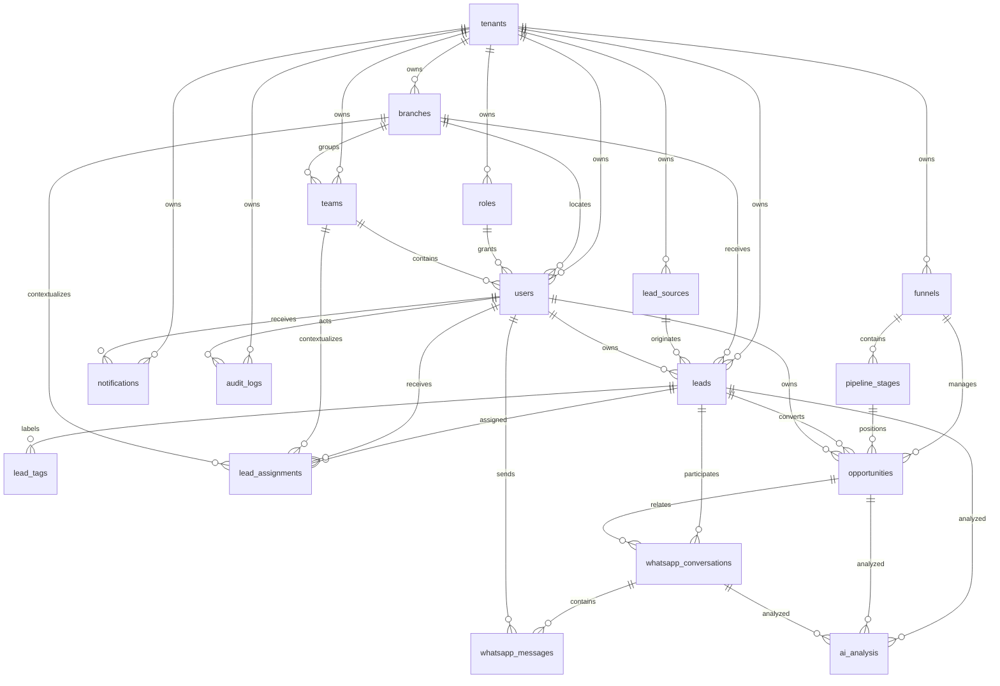

# Arquitetura de dados PostgreSQL/Supabase — CRM SaaS MVP

> Observação: os arquivos `crm-saas-blueprint.md` e `crm-saas-product-backlog.md` citados na solicitação não estavam presentes no repositório. Este documento consolida a arquitetura de dados do MVP com base nos requisitos informados: Supabase, multi-tenant, LGPD, escalabilidade e suporte a milhares de leads.

## 1. Escopo do MVP

A migração SQL completa está em `supabase/migrations/20260603000000_mvp_crm_schema.sql` e cria as tabelas solicitadas:

- `tenants`, `users`, `roles`, `teams`, `branches`
- `leads`, `lead_tags`, `lead_sources`
- `funnels`, `pipeline_stages`, `opportunities`
- `lead_assignments`
- `whatsapp_conversations`, `whatsapp_messages`
- `ai_analysis`
- `notifications`
- `audit_logs`

Além das tabelas, a migração cria tipos `enum`, funções auxiliares, triggers, índices, constraints, e políticas de Row Level Security (RLS) para Supabase.

## 2. Modelo ERD



## 3. Estratégia de multi-tenancy

### 3.1 Isolamento por `tenant_id`

O MVP usa o modelo **single database, shared schema, tenant discriminator**, no qual todas as tabelas de negócio possuem `tenant_id`. Esse modelo é indicado para MVP SaaS porque reduz custo operacional e simplifica automações do Supabase sem impedir evolução futura para particionamento ou sharding.

### 3.2 Autorização via Supabase Auth + RLS

- `public.users.id` referencia `auth.users(id)`, mantendo autenticação no Supabase Auth e perfil/autorização na tabela de aplicação.
- A função `public.current_tenant_id()` resolve o tenant do usuário autenticado.
- A função `public.same_tenant(tenant_id)` centraliza a regra de isolamento.
- As políticas RLS permitem acesso apenas ao próprio tenant e aplicam permissões por `roles.permissions`.
- A role JWT `service_role` é reservada para operações confiáveis de backend, Edge Functions, jobs e integrações.

### 3.3 Integridade entre tenants

PostgreSQL não impede automaticamente que uma FK aponte para registro de outro tenant quando a chave primária é apenas `id`. Para fechar essa lacuna, a migração cria a trigger `public.enforce_same_tenant_references()`, que valida referências críticas antes de `insert`/`update`.

### 3.4 Evolução para escala

Para milhares ou milhões de leads, recomenda-se:

1. Manter todos os índices críticos prefixados por `tenant_id`.
2. Usar paginação keyset por `created_at`/`id` nas listagens.
3. Arquivar soft-deleted e leads antigos com rotinas periódicas.
4. Particionar futuramente `leads`, `whatsapp_messages` e `audit_logs` por data ou hash de `tenant_id` caso necessário.
5. Usar `service_role` somente em rotinas confiáveis e nunca no cliente.

## 4. LGPD

A modelagem inclui campos dedicados para governança de dados pessoais:

- Base legal: `leads.lgpd_basis`.
- Registro de consentimento: `lgpd_consent_at`, `lgpd_consent_ip`, `lgpd_consent_source`, `lgpd_privacy_policy_version`.
- Retenção: `lgpd_data_retention_until`.
- Solicitação de eliminação: `lgpd_erasure_requested_at`.
- Soft delete: `deleted_at` nas principais tabelas.
- Auditoria: `audit_logs` para trilha de ações, entidade afetada, antes/depois, IP, agente e request id.

Para produção, recomenda-se complementar o schema com jobs de anonimização/eliminação e mascaramento seletivo em views ou RPCs para usuários sem permissão administrativa.

## 5. SQL completo

O SQL completo está versionado como migração Supabase em:

```text
supabase/migrations/20260603000000_mvp_crm_schema.sql
```

A migração contém:

- Criação de extensões `pgcrypto` e `citext`.
- Criação de enums de status e classificação.
- Criação das tabelas e chaves estrangeiras.
- Constraints de formato, unicidade, faixas numéricas e coerência temporal.
- Índices para consultas frequentes e alto volume.
- Funções auxiliares e triggers de `updated_at` e integridade multi-tenant.
- RLS completo para Supabase.

## 6. Índices principais

A migração prioriza índices compostos por `tenant_id` para reduzir varreduras por tenant:

- `leads_tenant_status_created_idx`: listas de leads por status e data.
- `leads_tenant_owner_status_idx`: carteira de leads por responsável.
- `leads_tenant_email_idx`, `leads_tenant_phone_idx`, `leads_tenant_whatsapp_idx`: busca de contatos.
- `leads_custom_fields_gin_idx`: filtros por campos customizados em JSONB.
- `opportunities_tenant_stage_idx`: pipeline por etapa.
- `whatsapp_messages_conversation_created_idx`: timeline de mensagens.
- `notifications_user_status_idx`: caixa de notificações do usuário.
- `audit_logs_tenant_created_idx`: auditoria por tenant e data.

## 7. Constraints principais

- Unicidade por tenant em slugs, roles, equipes, fontes, funis e etapas.
- `leads_score_range` e `ai_analysis_score_range` limitam scores de 0 a 100.
- `leads_lgpd_consent_required` exige data de consentimento quando a base legal é `consent`.
- `opportunities_closed_at_when_not_open` mantém coerência entre status e fechamento.
- `lead_assignments_one_active_per_lead_user` evita atribuição ativa duplicada para o mesmo usuário.
- Triggers de integridade impedem referências cruzadas entre tenants.

## 8. RLS para Supabase

Todas as tabelas do domínio têm RLS habilitado. As regras seguem este padrão:

- `select`: permitido apenas para registros do tenant do usuário autenticado, com restrições adicionais por dono ou permissão.
- `insert/update/delete`: permitido apenas no mesmo tenant e conforme `roles.permissions`.
- `notifications`: usuários leem e atualizam apenas suas próprias notificações.
- `audit_logs`: leitura restrita à permissão `audit.read`; escrita reservada a `service_role`.
- `tenants`: usuário lê apenas seu tenant; escrita reservada a `service_role`.

## 9. Permissões sugeridas para `roles.permissions`

Exemplo de chaves booleanas no JSONB `roles.permissions`:

```json
{
  "settings.manage": true,
  "users.read": true,
  "users.manage": true,
  "leads.create": true,
  "leads.read_all": true,
  "leads.update_all": true,
  "leads.delete": false,
  "leads.assign": true,
  "leads.manage_sources": true,
  "funnels.manage": true,
  "opportunities.read_all": true,
  "opportunities.manage_all": true,
  "whatsapp.read_all": true,
  "whatsapp.manage_all": true,
  "whatsapp.send": true,
  "ai.read": true,
  "ai.manage": true,
  "audit.read": true
}
```
